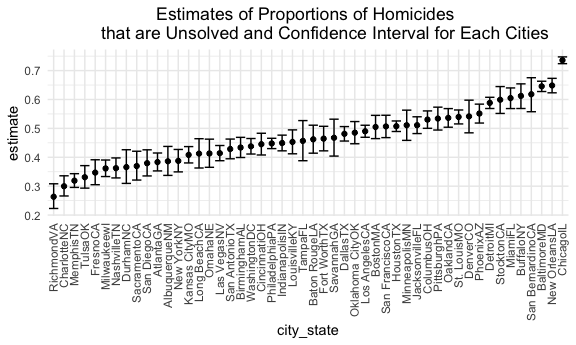
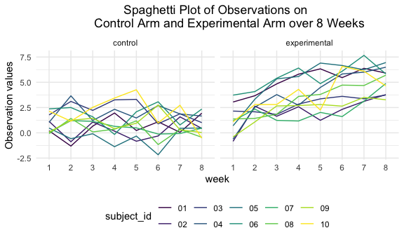

p8105\_hw5\_yj2686
================
Yiqun Jin
11/15/2021

## Problem 1

For this problem, we are interested in data gathered and made public by
*The Washington Post* on more than 52,000 criminal homicides over the
past decade in 50 large U.S. cities. The data included the location of
the killing, whether an arrest was made and basic demographic
information about each victim. The code chunk below imports and clans
the data.

``` r
homicide_df = read.csv("./data/homicide-data.csv", na = c("","Unknown")) %>% 
  mutate(city_state = str_c(city, state),
         resolution = case_when(
           disposition == "Closed without arrest" ~ "unsolved",
           disposition == "Open/No arrest" ~ "unsolved",
           disposition == "Closed by arrest" ~ "solved"
         )) %>% 
  relocate(city_state) %>% 
  filter(city_state != "TulsaAL")
```

Let’s focus on Baltimore, MD.

``` r
baltimore_df = homicide_df %>% 
  filter(city_state == "BaltimoreMD")

baltimore_summary = 
  baltimore_df %>% 
  summarize(
    unsolved = sum(resolution == "unsolved"),
    n = n()
  )

baltimore_test = prop.test(
  x = baltimore_summary %>% pull(unsolved), 
  n = baltimore_summary %>% pull(n))

baltimore_test %>% 
  broom::tidy()
```

    ## # A tibble: 1 × 8
    ##   estimate statistic  p.value parameter conf.low conf.high method    alternative
    ##      <dbl>     <dbl>    <dbl>     <int>    <dbl>     <dbl> <chr>     <chr>      
    ## 1    0.646      239. 6.46e-54         1    0.628     0.663 1-sample… two.sided

Iterate across states:

First, Write a function.

``` r
prop_test_function = function(city_df) {
  
  city_summary = 
    city_df %>% 
    summarize(
      unsolved = sum(resolution == "unsolved"),
      n = n()
    )
  
  city_test = prop.test(
    x = city_summary %>% pull(unsolved), 
    n = city_summary %>% pull(n))
  
  return(city_test)
}
```

Second, iterate across all cities.

``` r
results_df = 
  homicide_df %>% 
  nest(data = uid:resolution) %>% 
  mutate(
    test_results = map(data, prop_test_function),
    tidy_results = map(test_results, broom::tidy)
  ) %>% 
  select(city_state, tidy_results) %>% 
  unnest(tidy_results) %>% 
  select(city_state, estimate, starts_with("conf"))
```

Make a plot showing estimates and confidence intervals for each cities
and organize cities according to the proportion of unsolved homicides.

``` r
results_df %>% 
  mutate(city_state = fct_reorder(city_state, estimate)) %>% 
  ggplot(aes(x = city_state, y = estimate)) +
  geom_point() +
  geom_errorbar(aes(ymin = conf.low, ymax = conf.high)) +
  labs(title = "Estimates of Proportions of Homicides 
       that are Unsolved and Confidence Interval for Each Cities") +
  theme(axis.text.x = element_text(angle = 90, vjust = 0.5, hjust = 1),
        plot.title = element_text(hjust = 0.5))
```



## Problem 2

Create a tidy dataframe containing data from all participants, including
the subject ID, arm, and observations over time

``` r
zip_df = tibble(files = list.files("./data/zip_data/")) %>% 
  mutate(
    path = str_c("./data/zip_data/",files),
    result = map(path, read.csv)
  ) %>% 
  unnest(result) %>% 
  separate(
    files, c("arm","subject_id","format")
  ) %>% 
  select(-format, -path) %>% 
  mutate(
    arm = ifelse(arm == "con", "control", "experimental")
  ) %>% 
  pivot_longer(
    week_1:week_8,
    names_to = "week",
    names_prefix = "week_",
    values_to = "result"
  )
```

Make a spaghetti plot showing observations on each subject over time,
and comment on differences between groups.

``` r
zip_df %>% 
  ggplot(aes(x = week, y = result, color = subject_id)) +
  facet_grid(. ~ arm) +
  geom_line(aes(group = subject_id)) +
  labs(title = "Spaghetti Plot of Observations on 
       Control Arm and Experimental Arm over 8 Weeks") +
  theme(plot.title = element_text(hjust = 0.5))
```



According to the spaghetti plot above, the experimental arm showed a
increasing trend in observations over 8 weeks, but the control arm did
not show any obvious trend. Except week 1, the observations of
experimental arm did not have values below 0. However, several
observations of control arm have values below 0.

## Problem 3

``` r
library(tidyverse)

set.seed(10)

iris_with_missing = iris %>% 
  map_df(~replace(.x, sample(1:150, 20), NA)) %>%
  mutate(Species = as.character(Species))
```

Write a function.

``` r
fill_in_missing = function(vector) {
  if (is.numeric) {
    ...
  }
  
  if (is.character) {
    ...
  }
  
}
```
